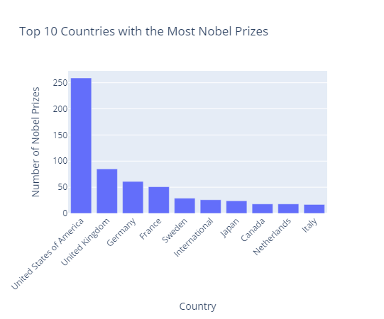
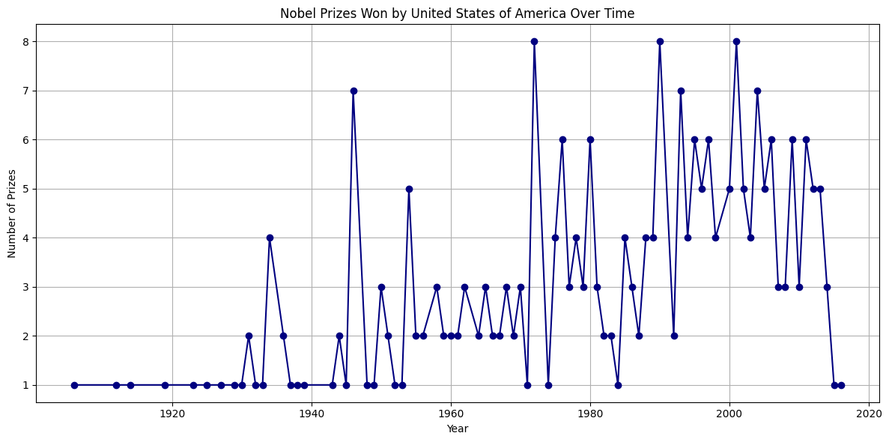
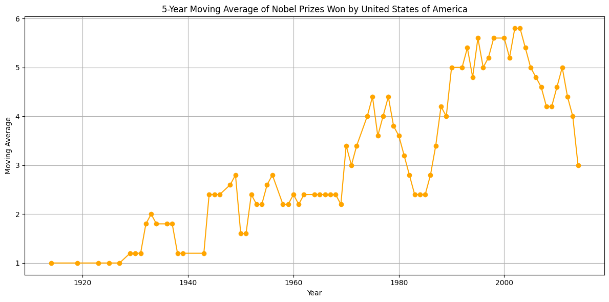

# Nobel Prize Analysis - Kodlasam Series

## Description

This work is the completion project of the Python module of my training at Kodlasam. An Exploratory Data Analysis (EDA) project on analyzing a dataset of Nobel Prize laureates to identify trends and patterns in Nobel Prize awards. The analysis explores the distribution of prizes across countries, genders, categories, and time periods.

## Dataset

Can be found in: , The dataset contains information on Nobel Prize laureates from 1901 to 2016. 

## Methodology

The analysis was conducted using Python with libraries such as Pandas, NumPy, Matplotlib, Seaborn, Plotly, and Unidecode. The following steps were performed:

1.  **Data Loading and Cleaning:**
    *   Corrected faulty characters using the `unidecode` library.
    *   Converted date columns to datetime objects.
    *   Handled missing values in country columns.
    *   Converted prize shares to float format.
    *   Calculated age at award.

2.  **Exploratory Data Analysis (EDA):**
    *   Identified the top countries with the most Nobel Prizes.
    *   Found the first male and female Nobel laureates.
    *   Analyzed the dominance of a specific country over time.
    *   Visualized the distribution of Nobel Prizes by gender, age, category, and year.
    *   Examined Nobel Prizes awarded during specific historical periods (1938-1945, 1947-1991).
    *   Analyzed Nobel Prizes awarded after the year 2000.

3.  **Visualization:**
    *   Created interactive bar charts, line plots, count plots, histograms, and box plots to visualize the data and identify trends.

## Key Findings & Visualizations

### Top 10 Countries with the Most Nobel Prizes

*Insights:* Dominance of USA followed by UK and Germany. This is likely due to many aspects but one big reason is economy.

### Nobel Prizes Won by United States of America Over Time

*Insights:* The moving average smooths yearly wins, showing sustained dominance.

### Nobel Laureates by Birth Country

*Insights:* This map effectively visualizes the geographical distribution of Nobel laureates across the world, providing a global perspective on where Nobel-level contributions originate.

## Limitations

*   The dataset only includes data up to 2016, so more recent trends are not captured.

## Usage

1.  Clone the repository: `git clone [https://github.com/Alleksenes/Nobel-Prize-Analysis-Kodlasam-Series.git]`
2.  Install the required libraries: `pip install pandas numpy matplotlib seaborn plotly unidecode rich`
3.  Run the Python notebook: `jupyter notebook nobel_prize_analysis.ipynb`

## License

under the MIT License - see the [LICENSE](LICENSE).
